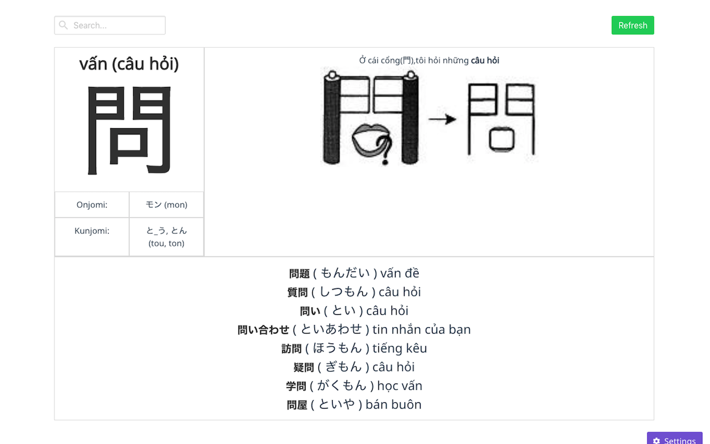

# kanji-mori

> A simple extensions to learn and remember Kanji

[](https://app.codeship.com/projects/343459)

[](https://chrome.google.com/webstore/detail/kanji-mori/fhmffjbmcgpcmcciodbiklofidhjdfcc)

# Screenshot


## Build Setup

``` bash
# install dependencies
npm install

# serve with hot reload at localhost:8080
npm run dev

# build for production with minification
npm run build
```
